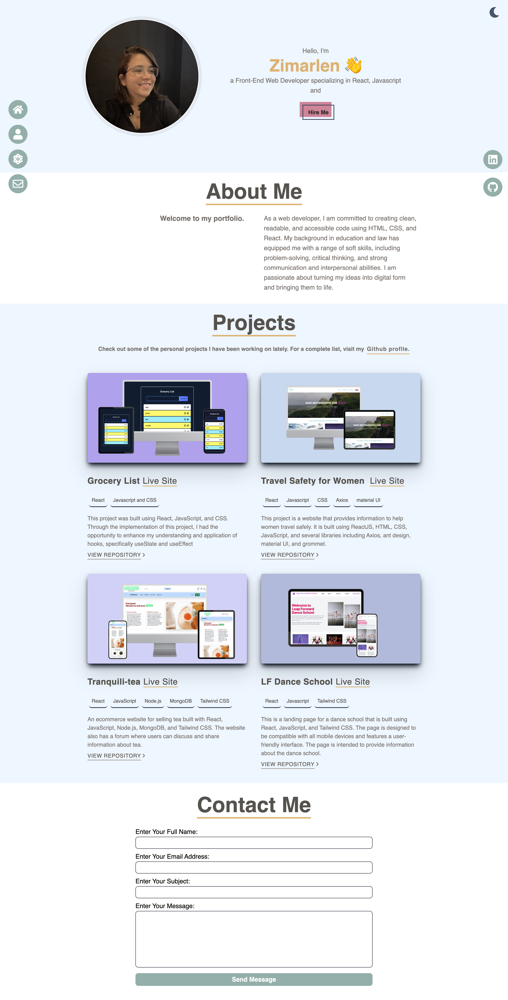

<h1 align="center">
  💻   Portfolio - Zimarlen Silva
</h1>

[View project here](https://zimarlen-portfolio.netlify.app/)

# Responsive Portfolio

- My personal portfolio to showcase some of my web development work.
- Built using React, Javascript and, Tailwind.
- Includes a dark and light mode.
- Compatible with all mobile devices and with a beautiful and pleasant user interface.

## Deployment 📦

Once you finish your setup. You need to put your website online!

I highly recommend to use [Netlify](https://netlify.com) because it is super easy.

## Technologies used 🛠️

- [React](https://reactjs.org/)- React 
- [Javascript](https://www.javascript.com/) - Javascript
- [Tailwind](https://tailwindui.com/) - Tailwind

## Author

- [**Zimarlen Silva**](https://github.com/ZihSilva/)

